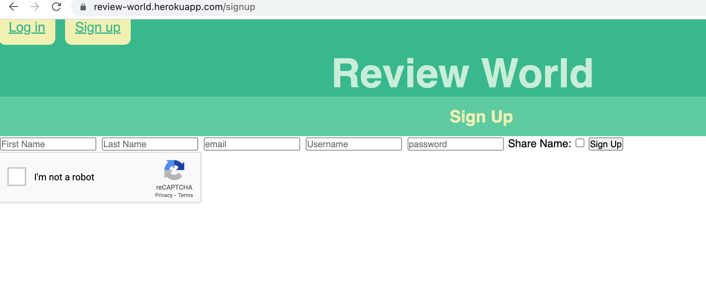

# Review-World

---

## Description

A user can view and add reviews to this website.
A user will have to create an account or login to an existing one.
When user is logged in, it has acces to the dasboard to add reviews to the website.
User can easlily logout.

---

## User Story

As a consumer of various products and IPs,
I want to search, view, and create reviews on many things,
So that myself and other users can know what to spend our time/money on.

---
## Acceptance Criteria

GIVEN a website to add and read many reviews

WHEN I visit the site for the first time

THEN I am presented with the homepage, which includes the option to log in

THEN I am prompted to either sign up or sign in

WHEN I choose to sign up

THEN I am prompted to create a username and password

WHEN I am signed in to the site

THEN I see navigation links for the homepage, the dashboard, and the option to log out

WHEN I click on the homepage option in the navigation

THEN I am taken to the homepage and presented with existing reviews of products

WHEN I enter a review and click on the submit button while signed in

THEN I am propted to enter product and catagory

WHEN I enter a review of the product I selected or created

THEN the review is saved and is updated to display the review, the review creator’s username

WHEN I click on the logout option in the navigation

THEN I am signed out of the site

---

## Tech

* [handlebars]
* [captcha]
* [Dotenv]
* [bcrypt]
* [MySQL2]
* [Javascript]
* [Express]
* [Sequelize]
* [express-session]

---

## Instalation

* No installation needed. Follow link: https://review-world.herokuapp.com/login

---

## Usage

Follow the instructions to sign up.

---

## Credits

* Aylin Morales / https://github.com/byaylin
* Febin George / https://github.com/fgeorge206
* John Hornick / https://github.com/hornickjohn
* Zazil Gomez / https://github.com/zazgh

---

## License

NA